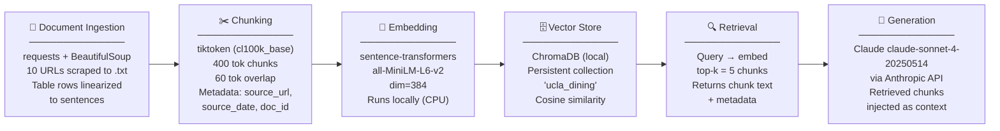

# Project 1 Planning: The Unofficial Guide

> Write this document before you write any pipeline code.
> Your spec and architecture diagram are what you'll use to direct AI tools (Claude, Copilot, etc.) to generate your implementation — the more specific they are, the more useful the generated code will be.
> Update the Retrieval Approach and Chunking Strategy sections if you change your approach during implementation.
> Update this file before starting any stretch features.

---

## Domain

<!-- What domain did you choose? Why is this knowledge valuable and hard to find through official channels? -->
**UCLA Campus Dining — Student Perspectives & Practical Navigation**

UCLA Dining has been ranked the #1 college dining program in the country nine out of the past ten years, yet the official website primarily surfaces marketing copy, menus, and institutional policies. The *lived experience* — which dining hall is worth a swipe on a Tuesday night, how the meal plan fine print actually works, which vendors lost swipe access in 2025-26, how to navigate severe food allergies without getting sick — lives scattered across student journalism, allergy community guides, editorial critiques, and admissions blogs. A first-year student trying to make smart dining decisions has no single trustworthy, consolidated resource.

---

## Documents

<!-- List your specific sources: URLs, subreddit names, forum threads, or file descriptions.
     Aim for at least 10 sources that together cover different subtopics or perspectives within your domain. -->

| # | Source | Description | URL or Location |
|---|--------|-------------|-----------------|
| 1 | Daily Bruin (News) | How students actually use meal swipes: plan popularity data, cost breakdowns, the 14 Premier plan dominance, off-campus pilot program details | https://dailybruin.com/2024/09/20/a-look-inside-how-students-interact-with-uclas-meal-swipe-system |
| 2 | Daily Bruin (Editorial) | Critical student editorial on dining inconsistency post-COVID: hall closures, reduced swipe values ($9→$4.33), staffing shortages, student frustration | https://dailybruin.com/2024/04/29/editorial-ucla-dining-must-prioritize-consistency-in-students-dining-experiences |
| 3 | UCLA Dining — Official Locations Page | Authoritative list of all dining halls and quick-service restaurants, hours structure, and payment methods (swipe vs. EasyPay vs. cash) | https://www.dining.ucla.edu/dining-locations |
| 4 | UCLA Dining — Meal Plan Overview | Official breakdown of the 6 meal plan tiers (11/14/19 × Regular/Premier), upgrade/downgrade deadlines, rollover rules | https://dining.ucla.edu/academic-year-meal-plans/ |
| 5 | UCLA Dining — Meal Prices | Price table for walk-in diners (BruinCard EasyPay rates by meal period: $17 breakfast, $20 lunch, $22 dinner), guest/visitor access rules | https://dining.ucla.edu/meal-prices |
| 6 | ASUCLA — Meal Swipes & Hours Guide | ASUCLA swipe exchange value ($10 as of July 2025), which vendors lost swipe access in 2025-26 (Panda Express, Subway, Veggie Grill, Kikka Sushi, Yoshinoya, Carl's Jr.) | https://www.asucla.ucla.edu/ucla/ucla-meal-swipes |
| 7 | UCLA Housing — Food Allergies Page | Official allergy navigation guide: icon labeling system for Big-8 allergens, registered dietitian contact (AsktheRD@ha.ucla.edu), cross-contamination warnings for fryers and bakery | https://portal.housing.ucla.edu/dining-services/food-allergies |
| 8 | Spokin — UCLA Allergy-Friendly Campus Guide | First-person account (2024 grad) navigating nut + sesame allergies while vegan at UCLA; specific safe/unsafe spots, off-campus fallbacks in Westwood Village | https://www.spokin.com/university-of-california-los-angeles-allergy-friendly-college-campus-guide |
| 9 | UCLA Admin VC — Plant-Based Pledge | UCLA Dining's commitment to 50% plant-based meals by 2027, student group partnerships, carbon footprint labeling, upcoming new plant-based restaurant | https://adminvc.ucla.edu/news-views/summer-2024/ucla-pledges-serve-50-plant-based-meals-2027 |
| 10 | AdmissionSight — UCLA Dining Guide | Comprehensive student-facing overview: dining hall personalities (De Neve vs. Bruin Plate vs. Epicuria), late-night hours, dietary labeling, guest dining rules, meal plan selection advice | https://admissionsight.com/ucla-dining/ |

- Short, dense policy pages (sources 4, 5, 6): key facts concentrated in tables and bullet lists — chunk by logical policy unit
- Long narrative editorials (sources 2): facts spread across paragraphs with context essential to meaning — chunk by argument/theme, not paragraph
- First-person review guides (sources 8, 10): anecdotal and advice-heavy — chunk by topic (allergy type, dining location, time of day)
- Institutional PR/news pieces (sources 1, 9, 11): structured with facts embedded in quotes and statistics — extract key claims as standalone chunks

---

## Chunking Strategy

<!-- How will you split documents into chunks?
     State your chunk size (in tokens or characters), overlap size, and explain why those
     numbers fit the structure of your documents.
     A review-heavy corpus warrants different chunking than a long FAQ. -->

**Chunk size:** 400 tokens

**Overlap:** 60 tokens

**Reasoning:**
The corpus is structurally heterogeneous — it mixes short-form policy tables (meal plan tiers, price grids), medium-length editorial paragraphs (Daily Bruin pieces), and long narrative guides (AdmissionSight, Spokin). A 400-token chunk is large enough to preserve a complete policy rule or a full student anecdote (which rarely exceeds 300 tokens) while staying well under most embedding model context limits. Chunks smaller than ~250 tokens risk splitting a single rule across boundaries — e.g., a meal plan upgrade policy needs its condition ("by the Sunday before the quarter") and its consequence ("otherwise processed the following quarter") to stay together.

A 60-token overlap is chosen to bridge sentence-boundary splits without wasteful duplication. Because several sources have long transitional sentences that carry context from a prior paragraph (common in the Daily Bruin editorials), 60 tokens ensures that a retrieval hit on the second chunk still contains enough of the preceding setup to be coherent in generation.

Policy tables (sources 4, 5, 6) will be pre-processed: each table row will be linearized into a sentence ("The 11 Regular meal plan costs approximately $5,300 for 2024-25") before chunking, so the embedding can match against natural-language queries rather than raw pipe-delimited text.

---

## Retrieval Approach

<!-- Which embedding model are you using (e.g., all-MiniLM-L6-v2 via sentence-transformers)?
     How many chunks will you retrieve per query (top-k)?
     If you were deploying this for real users and cost wasn't a constraint, what tradeoffs
     would you weigh in choosing a different embedding model — context length, multilingual
     support, accuracy on domain-specific text, latency? -->

**Embedding model:** `all-MiniLM-L6-v2` via `sentence-transformers`

**Top-k:** 5

**Production tradeoff reflection:**
`all-MiniLM-L6-v2` is the right choice here for a class project: it runs locally with no API cost, has a 256-token context window that suits our 400-token chunks (with the model encoding the first 256 tokens of each chunk — which is fine since the most information-dense content leads each chunk), and produces embeddings of dimension 384 that are fast to index and query with ChromaDB.

In a real deployment, the tradeoffs worth weighing are:

- **Context length:** `all-MiniLM-L6-v2`'s 256-token ceiling will silently truncate longer chunks. A production system might use `all-mpnet-base-v2` (512 tokens) or `text-embedding-3-small` from OpenAI (8,191-token ceiling) to handle the long Spokin and AdmissionSight documents without truncation loss.
- **Domain specificity:** General-purpose models may not score "AYCE dining hall" and "all-you-care-to-eat" as semantically close. A model fine-tuned on university or hospitality text would improve recall for jargon-heavy queries.
- **Multilingual support:** UCLA's student body is ~35% international. A model like `paraphrase-multilingual-MiniLM-L12-v2` would support queries in Mandarin or Korean at modest accuracy cost — a real product decision.
- **Latency:** OpenAI's embedding API adds network round-trip latency (~50-150ms per batch) versus local inference (~5ms). For a high-traffic chatbot, local inference or pre-computed embeddings cached by document hash would be preferred.

---

## Evaluation Plan

<!-- List your 5 test questions with their expected correct answers.
     Questions should be specific enough that you can judge whether the system's response
     is right or wrong. "What are good dining halls?" is too vague.
     "What do students say about wait times at [dining hall name] during lunch?" is testable. -->

| # | Question | Expected answer |
|---|----------|-----------------|
| 1 | Which ASUCLA food vendors can students no longer use meal swipes at starting in the 2025-26 academic year? | Panda Express, Carl's Jr., Subway, Veggie Grill, Kikka Sushi, Yoshinoya, and the UCLA Store Market |
| 2 | What is the cash value of one meal swipe when used at an ASUCLA restaurant, as of July 2025? | $10 |
| 3 | What is the deadline for downgrading your UCLA meal plan for an upcoming quarter? | The Sunday before the quarter begins (the Sunday prior to the start of that quarter's classes) |
| 4 | What allergen cross-contamination risk exists specifically in UCLA Dining's on-campus bakery? | The bakery does not use peanuts but does process tree nuts, creating potential for cross-contact and contamination in items like hamburger buns, pizza dough, and café sandwiches |
| 5 | What percentage of UCLA Dining's campus entrées does the university plan to make plant-based by 2027? | 50% |

---

## Anticipated Challenges

<!-- What could go wrong? Name at least two specific risks with reasoning.
     Consider: noisy or inconsistent documents, missing source attribution, off-topic
     retrieval, chunks that split key information across boundaries. -->

1. **Swipe policy churn causing stale retrieval hits.** The ASUCLA swipe value changed from $9 to $4.33 (per the 2024 editorial) and then again to $10 (per the July 2025 update), and the list of accepted vendors shrank significantly for 2025-26. If chunks from the 2024 Daily Bruin editorial (which cites the $4.33 value and references vendors now removed) are retrieved alongside the current ASUCLA page, the generator may synthesize a contradictory or outdated answer. Mitigation: add a `source_date` metadata field to each chunk and surface it in the retrieved context so the generator can reason about recency, or filter retrieval to prefer the most recent chunk when duplicates cover the same fact.

2. **Policy tables chunking into meaningless fragments.** The meal prices table (source 5) has rows like "Students: Non-OCH Residents | $17.00 | $20.00 | $22.00 | $27.00" — if this is embedded as-is, the vector representation will be nearly identical across rows and won't match natural queries like "how much does dinner cost without a meal plan?" The pre-processing step (linearizing rows into sentences) described in the Chunking Strategy is essential; if skipped or done incorrectly, retrieval precision for price-related queries will be poor regardless of top-k.

---

## Architecture

<!-- Draw a diagram of your pipeline showing the five stages:
     Document Ingestion → Chunking → Embedding + Vector Store → Retrieval → Generation
     Label each stage with the tool or library you're using.
     You can use ASCII art, a Mermaid diagram, or embed a sketch as an image.
     You'll use this diagram as context when prompting AI tools to implement each stage. -->

**Data flow notes:**
- Ingestion and chunking run once offline; embeddings are persisted to disk via ChromaDB
- At query time, only the Embedding → Retrieval → Generation path runs (steps C→D→E→F)
- The `source_date` metadata field is passed through to the generation prompt so the model can flag potentially outdated information

---

## AI Tool Plan

<!-- For each part of the pipeline below, describe:
     - Which AI tool you plan to use (Claude, Copilot, ChatGPT, etc.)
     - What you'll give it as input (which sections of this planning.md, which requirements)
     - What you expect it to produce
     - How you'll verify the output matches your spec

     "I'll use AI to help me code" is not a plan.
     "I'll give Claude my Chunking Strategy section and ask it to implement chunk_text()
     with my specified chunk size and overlap" is a plan. -->

### Stage 1 — Document Ingestion (`ingest.py`)
- **Tool:** Claude (claude.ai chat)
- **Input:** The Documents table from this file (10 URLs + descriptions) plus the note about linearizing table rows
- **Prompt strategy:** "Here are 10 URLs for a RAG project on UCLA campus dining. Write a Python script `ingest.py` that fetches each URL with `requests`, extracts main-body text with `BeautifulSoup` (stripping nav, footer, and script tags), detects HTML `<table>` elements and linearizes each row into a sentence of the form `'[col1 header]: [value], [col2 header]: [value]'`, and saves each document as a `.txt` file in `./docs/` with the filename `doc_01.txt` through `doc_10.txt`. Also save a `metadata.json` mapping filename → {url, scraped_date}."
- **Expected output:** A working `ingest.py` with BeautifulSoup parsing and table linearization
- **Verification:** Run the script, confirm 10 `.txt` files exist in `./docs/`, spot-check that `doc_05.txt` (meal prices) contains sentences like "Students Non-OCH Residents dinner price: $22.00" rather than raw pipe-delimited table rows

### Stage 2 — Chunking (`chunk.py`)
- **Tool:** Claude (claude.ai chat)
- **Input:** The Chunking Strategy section of this file verbatim
- **Prompt strategy:** "Implement `chunk_text(text: str, doc_id: str, source_url: str, source_date: str) -> list[dict]` using `tiktoken` with the `cl100k_base` encoding. Chunk size: 400 tokens. Overlap: 60 tokens. Each returned dict should have keys: `text`, `doc_id`, `chunk_index`, `source_url`, `source_date`. Write a `chunk_all_docs()` function that reads every `.txt` from `./docs/`, loads `metadata.json` for source_url and source_date, calls `chunk_text()`, and returns a flat list of all chunk dicts."
- **Expected output:** `chunk.py` with both functions
- **Verification:** Run on `doc_01.txt` (Daily Bruin news article, ~1,200 tokens), confirm output is 3-4 chunks, check that chunk boundaries don't split mid-sentence by inspecting the last 60 tokens of chunk 1 and first 60 of chunk 2 for overlap

### Stage 3 — Embedding + Vector Store (`embed_and_store.py`)
- **Tool:** Claude (claude.ai chat)
- **Input:** Architecture diagram (Stage 3 and 4 boxes) plus the Retrieval Approach section
- **Prompt strategy:** "Write `embed_and_store.py` that takes the output of `chunk_all_docs()`, embeds each chunk's `text` field using `sentence-transformers` model `all-MiniLM-L6-v2`, and upserts into a persistent ChromaDB collection named `ucla_dining` stored at `./chroma_db/`. Use the chunk's `doc_id + '_' + str(chunk_index)` as the ChromaDB document ID. Store `source_url` and `source_date` as ChromaDB metadata. Include a `__main__` block that runs the full pipeline and prints the total number of chunks stored."
- **Expected output:** Working `embed_and_store.py`
- **Verification:** Run it, open ChromaDB with a quick `collection.count()` call, confirm count is plausible (expect 60–120 chunks for 10 documents at 400 tokens each), then run a manual `.query()` for "how much does dinner cost" and confirm the top result is from `doc_05.txt`

### Stage 4 — Retrieval + Generation (`query.py`)
- **Tool:** Claude (claude.ai chat)
- **Input:** Retrieval Approach section (model, top-k=5), Evaluation Plan (5 test questions as sample inputs), Architecture diagram (Retrieval + Generation boxes)
- **Prompt strategy:** "Write `query.py` with a function `answer_question(question: str) -> str` that: (1) embeds the question with `all-MiniLM-L6-v2`, (2) queries the `ucla_dining` ChromaDB collection for top-5 chunks, (3) builds a prompt that includes the retrieved chunks with their source_url and source_date, instructs the model to answer only from provided context and to flag if context is outdated relative to other chunks, and (4) calls `claude-sonnet-4-20250514` via the Anthropic Python SDK and returns the response text. Include a `__main__` block that runs all 5 evaluation questions and prints question + answer."
- **Expected output:** Working `query.py` that produces verifiable answers to the 5 eval questions
- **Verification:** Run the 5 evaluation questions from the Evaluation Plan and compare each answer against the expected answer column. A correct answer on ≥4/5 questions passes the baseline. For Q1 (vendor list), check that all 6 vendors are named. For Q3 (deadline), check the exact phrasing "Sunday before the quarter begins" appears.

**Milestone 3 — Ingestion and chunking:**

**Milestone 4 — Embedding and retrieval:**

**Milestone 5 — Generation and interface:**
